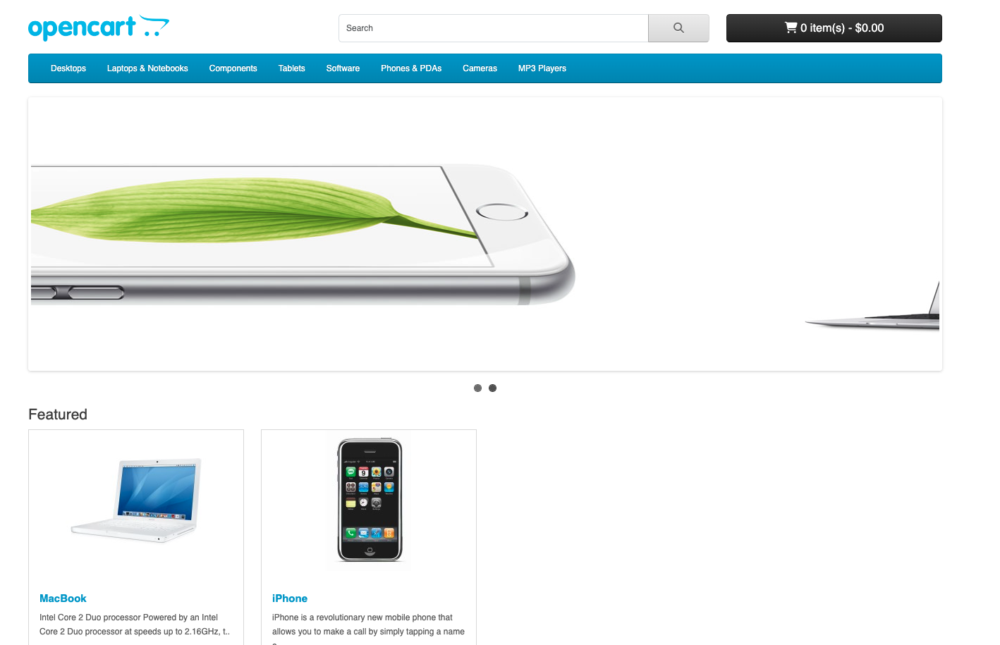

# Демонстрационный проект по тестированию web-приложения Opencart.



### Для запуска тестов в docker-контейнере необходимо:
- В docker-compose.yml прописать OPENCART_HOST - IP и порт, на котором будет поднят Opencart (формат 192.168.0.111:8081)  
(использовать внешний адрес ПК, можно узнать по команде ipconfig для Windows или ifconfig для MAC)
- В Dockerfile после --url вписать путь до Opencart
- В Dockerfile после --executor вписать путь до Selenoid (Selenoid должен быть поднят)  
Полная команда должна выглядеть примерно так:
```shell
CMD ["pytest", "--remote", "--url", "http://192.168.0.111:8081", "--executor", "192.168.0.111"]
```
- Запустить тесты командой:
```shell
docker compose up
```
По этой команде поднимется Opencart и запустятся тесты.
